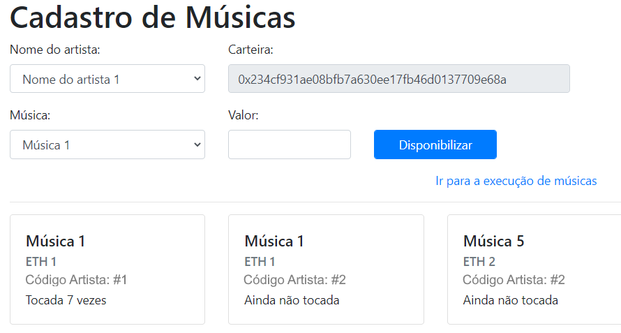
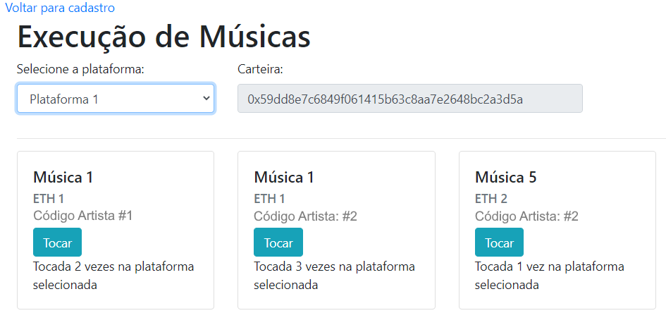

# Gerenciamento de Royalties com Smart Contract

## Objetivo
>Simulação de processos envolvendo execução de um contrato inteligente voltado para gerenciamento de royalties entre plataforma de disponibilização de músicas e artistas.  

## Telas/Funcionalidades
**[Cadastro de Músicas](./index.html)**  

* Cadastro de músicas para determinado artista, associando a sua carteira (Etherium) a cada música.  
  * A cada música cadastrada, um valor (Eth) relativo à transação é debitado da carteira do artista.
  * A mesma música pode ser cadastrada para diferentes artistas.
  * O número total de vezes que a música é tocada (independentemente da plataforma) é apresentada ao usuário.
  * Não é possível cadastrar mais de uma vez uma música já registrada para o mesmo artista.  
  * Mensagens de erro e sucesso são apresentadas ao usuário.
  
  
  
**[Execução de Músicas](./index_play.html)**  

* Execução da música (simulação) em diferentes plataformas, sendo a execução associada à carteira da plataforma escolhida.
  * A cada música executada, o valor cadastrado para a música é debitado da carteira da plataforma selecionada e creditado na carteira do artista relacionado à musica.
  * O número de vezes que a música é tocada em cada plataforma é apresentada ao usuário.
  * Mensagens de erro e sucesso são apresentadas ao usuário.
  

## Pré-requisitos
* [Node.js instalado](https://nodejs.org/en/download/)  
* [Ganache em execução](https://www.trufflesuite.com/ganache)

## Instalação
>npm init  
>npm install web3@0.20.0 solc@0.4.18  

## Criação do contrato
**Executar os seguintes comandos:**  
  
>node  
Web3 = require('web3')  
web3 = new Web3(new Web3.providers.HttpProvider("HTTP://127.0.0.1:7545"))  
solc = require('solc')  
sourceCode =  fs.readFileSync('ExecutarMusica.sol').toString()  
compiledCode = solc.compile(sourceCode)  
contractABI = JSON.parse(compiledCode.contracts[':ExecutarMusica'].interface)  
executarMusicaContract = web3.eth.contract(contractABI)  
byteCode = compiledCode.contracts[':ExecutarMusica'].bytecode  
executarMusicaDeployed = executarMusicaContract.new({data:byteCode, from:web3.eth.accounts[0], gas:4700000})  
executarMusicaInstance =  executarMusicaContract.at(executarMusicaDeployed.address)  
executarMusicaDeployed.address  
